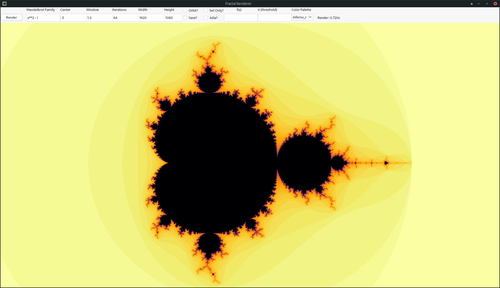
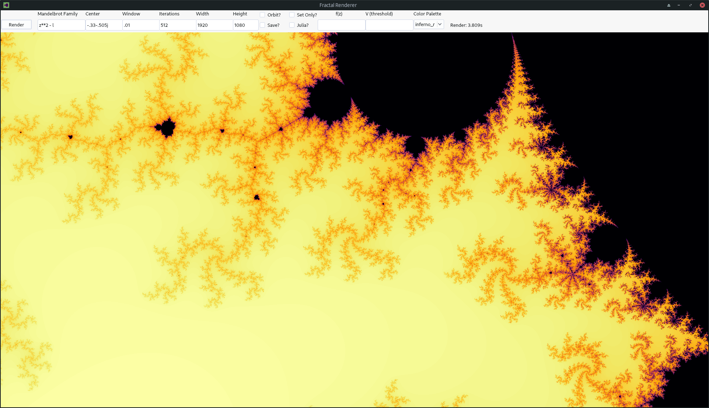
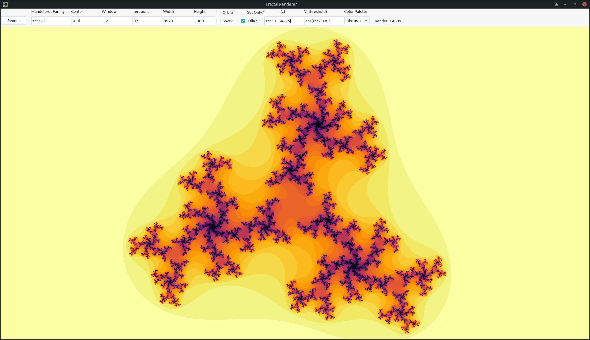

# Fractal Renderer

This application is a feature rich 2D fractal rendering engine that supports the rendering of both Julia sets and generalized Mandelbrot sets of complex polynomial functions.

To run the application, simply clone the repository and execute the command `pip install -r requirements.txt` followed by `./run`

